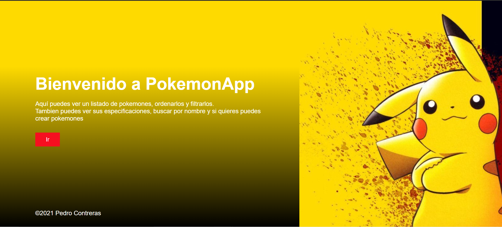

<h1 align="center" width=75%>Hola! yo soy Pedro Contreras  </h1>
<h3 align="center">Soy un full stack developer curioso con gran capacidad de resolución de problemas, siempre dispuesto a enseñar y aprender de los demás.</h3>

<h3> > Contáctame: </h3>

  <code></code>
  <code></code>
  <code></code>
  

<h3> > Skills </h3>

  <code> JavaScript</code>
  <code> HTML</code>
  <code> CSS</code>
  <code> React</code>
  <code> Redux</code>
  
  <code> Node.Js</code>
  <code> Express.Js</code>
  <code> PostgreSQL</code>
  <code> MongoDB</code>
  
   <code> Sequelize</code>

<h3> > Mis Proyectos </h3>

<a href="https://github.com/josegarrera/ecommerce" >Store! - E-commerce </a>

<a href="https://github.com/Pavegliobruno/Videogames" >PokemonApp</a>

<!-- <a href="https://" >Weather-App </a>

 -->
